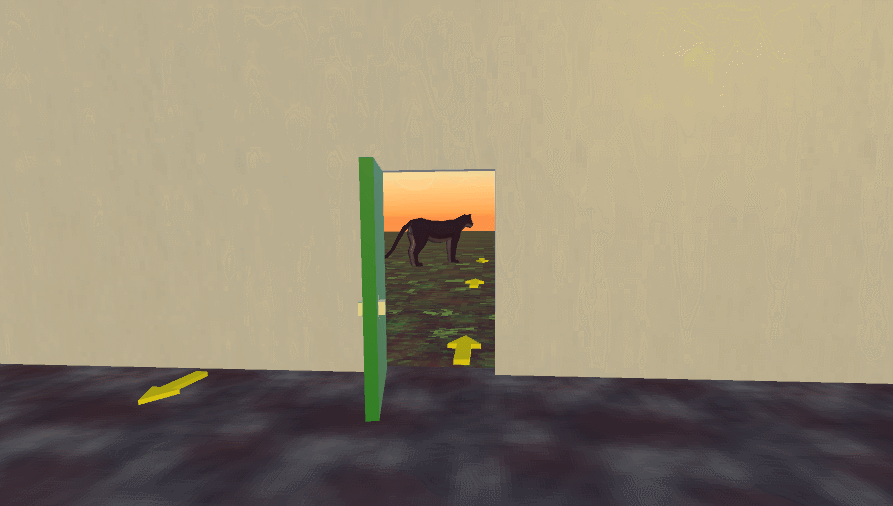

# Book Club Game Jam 2025
A 3D point-and-click adventure game developed in one month for the Book Club Game Jam 2025 in Unity.

For core gmapleay code see [Player.cs](https://github.com/0megq/BookClubGameJam2025/blob/master/Assets/Scripts/Player.cs) and [Interactable.cs](https://github.com/0megq/BookClubGameJam2025/blob/master/Assets/Scripts/Interactable.cs).

## Outline Shader Code Sample
See [Outline.shader](https://github.com/0megq/BookClubGameJam2025/blob/master/Assets/Art/Materials/Outline.shader) and [BakeVertexNormal.cs](https://github.com/0megq/BookClubGameJam2025/blob/master/Assets/Scripts/BakeNormalsToVertexColors.cs).

